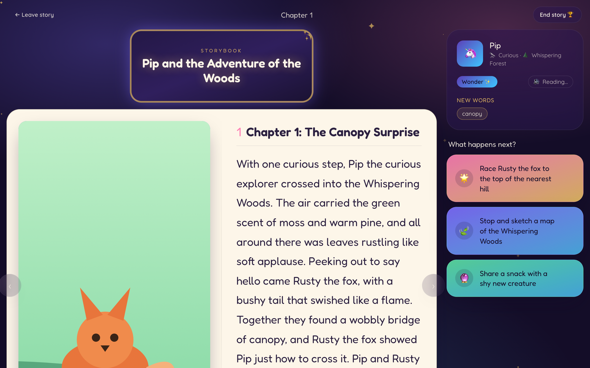
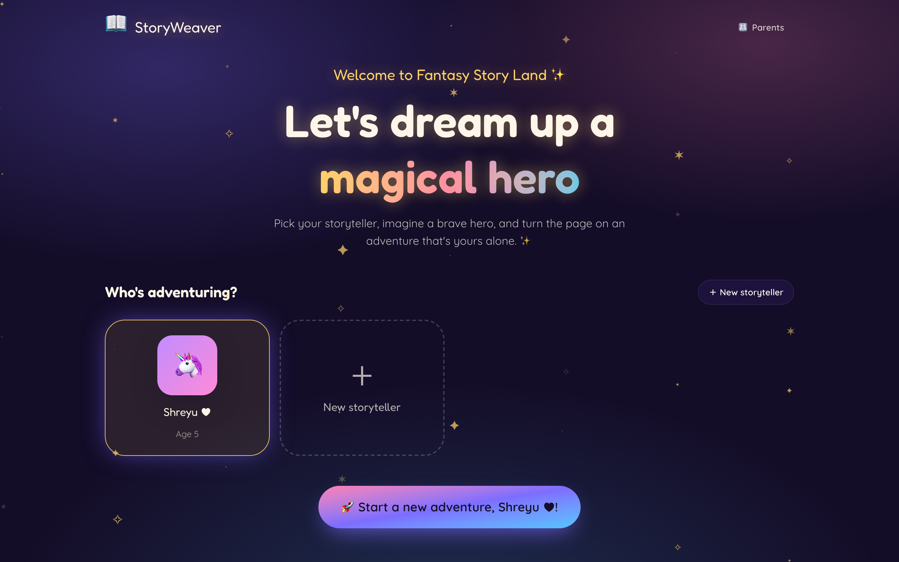
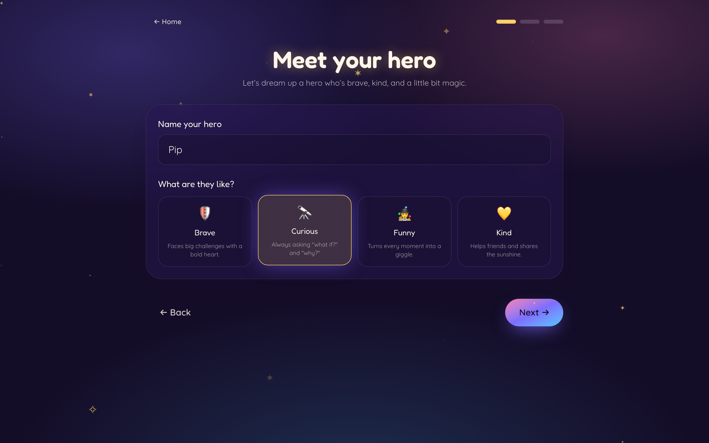
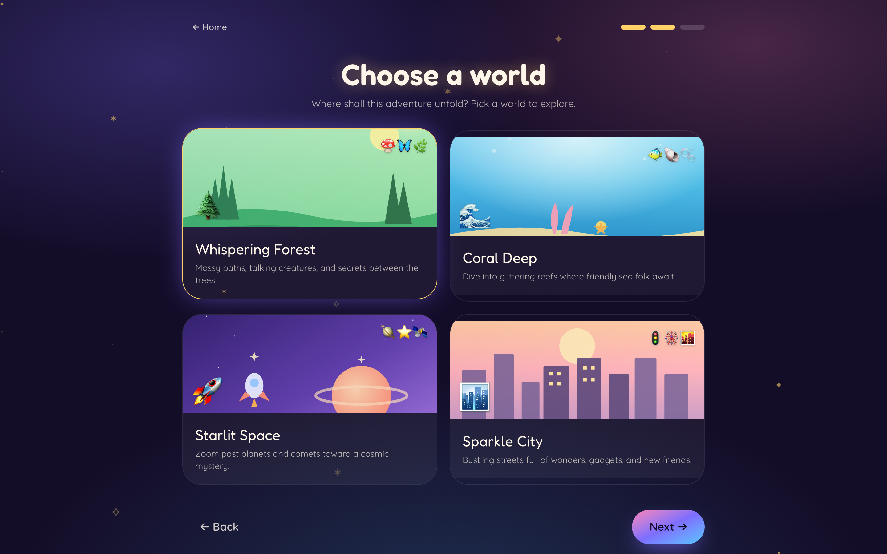
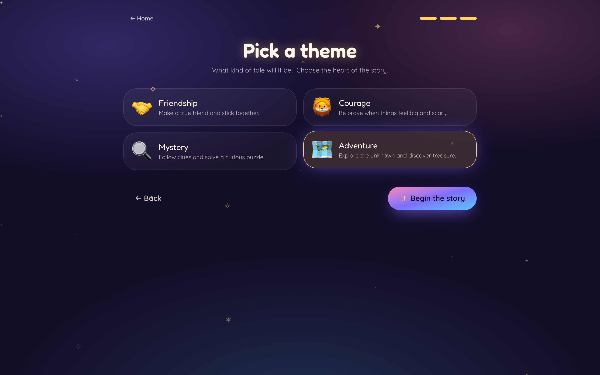
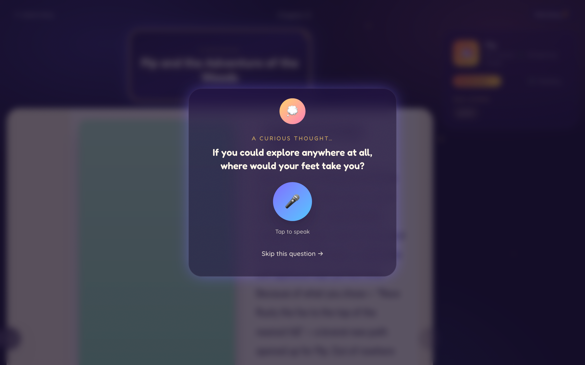
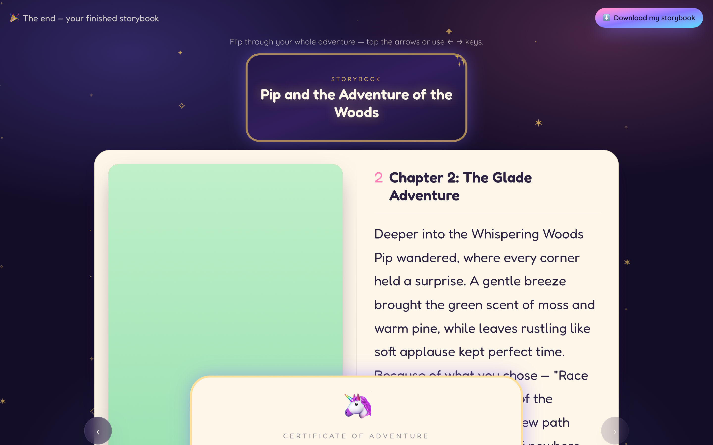
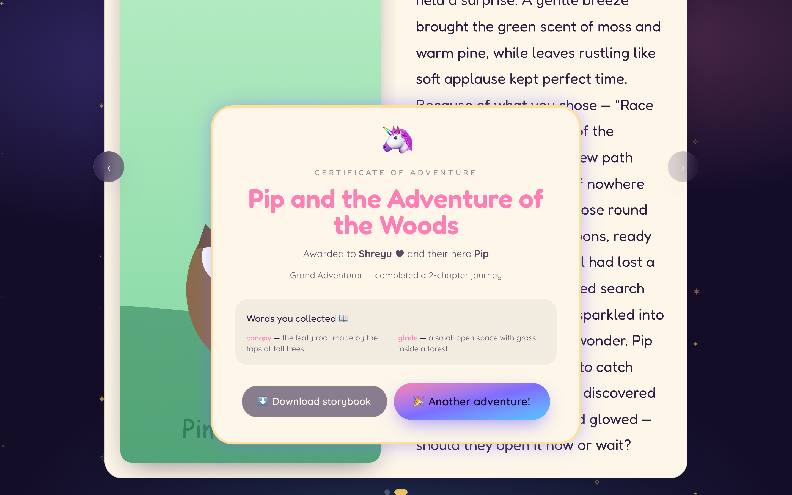

<div align="center">

# 📖✨ StoryWeaver

### _Welcome to Fantasy Story Land_ — where the child is the **co-author**, not the audience.

An agentic, AI-powered interactive storybook for children **ages 0–12**. Claude weaves an original
adventure, pauses at every chapter, listens to the child's voice to decide what happens next,
illustrates each scene with friendly animals, and asks gentle curiosity questions that grow
imagination and vocabulary — then hands back a downloadable keepsake storybook.

<br/>


<br/>



<sub>A real two-page storybook: square title cover, scene illustration, streaming text, and three branching choices.</sub>

</div>

---

## ✨ Highlights

- 🪄 **Agentic, not a chatbot.** A coordinated loop of specialized agents (story · curiosity · image · vocabulary) with persistent memory and media generation.
- 📚 **A real book.** Big two-page spread, a square title cover, page-turn by click / arrows / `← →` keys, and flip-back through every chapter.
- 🦊 **Animal-led adventures.** Each chapter stars a named animal companion with its own scene illustration.
- 🎙️ **Voice-first & soft narration.** Children speak their choices (Web Speech API); a warm, gentle female voice reads the story aloud.
- 🧠 **Curiosity over plot.** After each chapter, one open-ended Socratic question — never a yes/no — with an always-available _Skip_.
- 👶 **Ages 0–12.** Five age tiers from soothing infant lullabies to layered tween moral choices; length and vocabulary scale with age.
- 🏆 **Keepsake ending.** A finished, flip-through storybook + a **Certificate of Adventure** + a one-click **downloadable, printable storybook**.
- 🔌 **Runs fully offline.** No API keys required — a built-in story engine, animal SVGs, and browser narration power everything; keys simply upgrade to live AI.

---

## 📸 A tour

| | |
|---|---|
| **Welcome — pick your storyteller** <br/>  | **Meet your hero** <br/>  |
| **Choose a world** <br/>  | **Pick a theme** <br/>  |
| **The storybook** <br/>  | **A curious thought** <br/>  |
| **The finished keepsake** <br/>  | **Certificate + download** <br/>  |

> 💡 The downloaded keepsake (`docs/storybook-sample.html`) is a self-contained, print-friendly file — open it and **Print → Save as PDF** for a real book.

---

## 🚀 Quickstart (local, no Docker)

> **Prereqs:** Python 3.12+, Node 20+, and [`uv`](https://docs.astral.sh/uv/)
> (`curl -LsSf https://astral.sh/uv/install.sh | sh` → installs to `~/.local/bin/uv` on macOS).
> Redis is **optional** — the backend falls back to an in-memory store automatically.

**Backend** → http://localhost:8000
```bash
cd backend
~/.local/bin/uv sync
~/.local/bin/uv run uvicorn app.main:app --reload --port 8000
```

**Frontend** → http://localhost:5173  ← _open this_
```bash
cd frontend
npm install
npm run dev
```

The default storyteller **Shreyu ♥** is created automatically. That's it — start an adventure.

> 🔑 To unlock live AI, copy `backend/.env.example` → `backend/.env` and add keys. No code changes needed — the services detect keys and swap in.

<details>
<summary>Run with Docker instead</summary>

```bash
docker compose up --build   # then open http://localhost:5173
```
</details>

---

## 🧩 How it works

```
storyweaver/
├── frontend/                 # React 19 + Vite SPA
│   └── src/
│       ├── pages/            # Home · Setup · Story · ParentView
│       ├── components/story/  # StoryBook, ChapterReveal, VoiceInput, Curiosity…
│       ├── hooks/            # useStoryStream (SSE) · useVoiceInput · useAudio
│       └── store/            # Zustand session + completed chapters
├── backend/                  # FastAPI (async) — agentic engine + API
│   └── app/
│       ├── main.py           # app, CORS, /static mount, routers under /api
│       ├── agents/           # story · curiosity · image · vocab
│       ├── services/         # claude · elevenlabs · image · redis (+ fallbacks)
│       ├── routers/          # profiles · story · media · dashboard
│       ├── models/           # SQLAlchemy async models + Pydantic schemas
│       └── core/             # config (pydantic-settings) · prompts · logging
│   └── static/images/        # animal scene SVGs + generated art
└── docker-compose.yml
```

The **frontend** talks to the **backend** over JSON + **SSE** (chapters stream in sentence-by-sentence).
**Redis** holds live agentic session context (in-memory fallback); **SQLite** persists profiles, stories, and vocabulary.

### The agentic loop

1. **SETUP** — collect the child's profile, hero, world & theme; seed the persistent story universe.
2. **CHAPTER** _(repeats, up to 8)_ — `story_agent` streams the next chapter, `image_agent` illustrates the scene, `curiosity_agent` poses one question, and three branching choices appear.
3. **VOICE / CHOICE** — the child speaks or taps; the transcript is woven back into the next chapter.
4. **ENDING** — `story_agent` writes a satisfying conclusion, a certificate is minted, and `vocab_agent` recaps the new words.

| Agent | Responsibility |
|-------|----------------|
| `story_agent` | Drives the narrative arc, streams chapters, writes the ending. |
| `curiosity_agent` | One age-appropriate Socratic question per chapter. |
| `image_agent` | Scene illustration (Replicate FLUX → animal-SVG fallback). |
| `vocab_agent` | Extracts & explains the new words for the recap. |

---

## 🛠️ Tech stack

**Frontend** — React 19 · TypeScript · Vite · Tailwind CSS v4 · Framer Motion · shadcn-style UI · Web Speech API · Howler.js · TanStack Query v5 · Zustand · React Router v7

**Backend** — FastAPI (async) · Pydantic v2 · Anthropic SDK (`claude-sonnet-4-5`, streaming) · ElevenLabs · Replicate FLUX · SQLAlchemy async + aiosqlite · redis-py · structlog · `uv`

**Infra** — Docker Compose · Python 3.12+ · Node 20+

---

## ⚙️ Environment

Copy `backend/.env.example` → `backend/.env` and fill only what you need. **Everything works with zero keys.**

| Variable | Purpose | Without it |
|----------|---------|------------|
| `ANTHROPIC_API_KEY` | Live Claude story generation | Built-in canned story engine |
| `REPLICATE_API_TOKEN` | FLUX scene images | Animal placeholder SVGs |
| `ELEVENLABS_API_KEY` | Character voice synthesis | Browser `speechSynthesis` |
| `REDIS_URL` | Session / agentic context store | In-memory fallback |
| `DATABASE_URL` | SQLAlchemy async URL | `sqlite+aiosqlite:///./storyweaver.db` |
| `PARENT_DASHBOARD_SECRET` | Parent dashboard secret | — |
| `CORS_ORIGINS` | Allowed origins | `http://localhost:5173` |
| `LOG_LEVEL` | structlog level | `INFO` |

---

## 🔌 API

Base `/api` — backend `:8000`, frontend `:5173`.

| Method | Endpoint | Description |
|--------|----------|-------------|
| `POST` / `GET` | `/api/profiles/` | Create / list child profiles |
| `POST` | `/api/story/start` | Begin a story → `{session_id, story_id, title}` |
| `GET`  | `/api/story/stream/{session_id}` | SSE chapter stream (`sentence` · `meta` · `done`) |
| `POST` | `/api/story/choice` | Submit a choice (text or voice transcript) |
| `POST` | `/api/story/curiosity-answer` | Submit a curiosity response |
| `POST` | `/api/story/end` | Generate ending + certificate |
| `GET`  | `/api/story/history/{child_id}` | List past stories |
| `POST` | `/api/media/image` | Scene image (FLUX; placeholder fallback) |
| `POST` | `/api/media/voice/{character}` | Character voice (ElevenLabs; Phase 2) |
| `GET`  | `/api/dashboard/{child_id}` | Parent dashboard data |

---

## 🗺️ Roadmap

- ✅ **Phase 1 — MVP:** story loop, SSE streaming, voice input, SQLite, the book UI, animal art, age tiers, downloadable keepsake.
- 🔜 **Phase 2:** live Claude stories, FLUX image generation, ElevenLabs voices, deeper curiosity & vocab agents (all key-activated, no code changes).
- 🔮 **Phase 3:** parent dashboard analytics, certificate PDF export, story replay, production hardening.

See [`PROGRESS.md`](PROGRESS.md) for the detailed handoff log.

---

## 📄 License

Released under the [MIT License](LICENSE). © 2026 Santosh Goteti.

<div align="center"><sub>Made with 🪄 for curious little storytellers.</sub></div>
